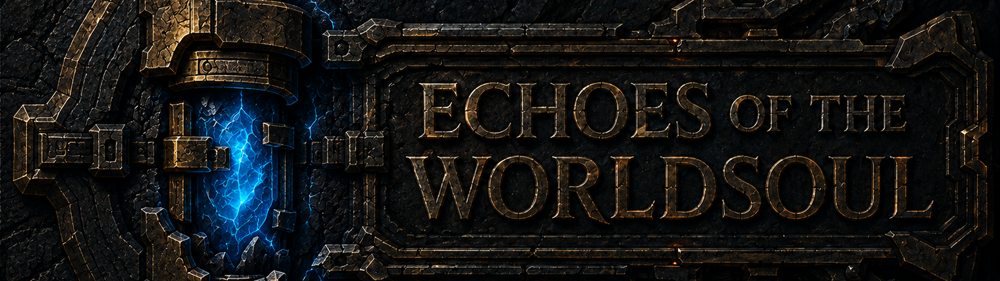
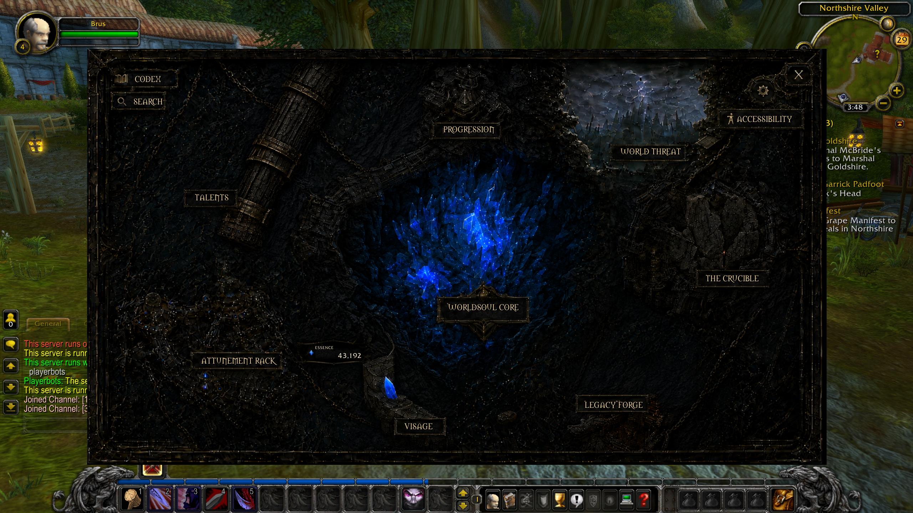
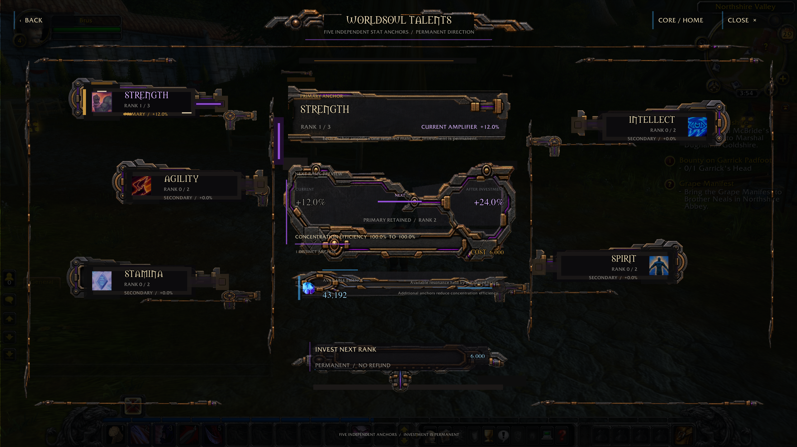
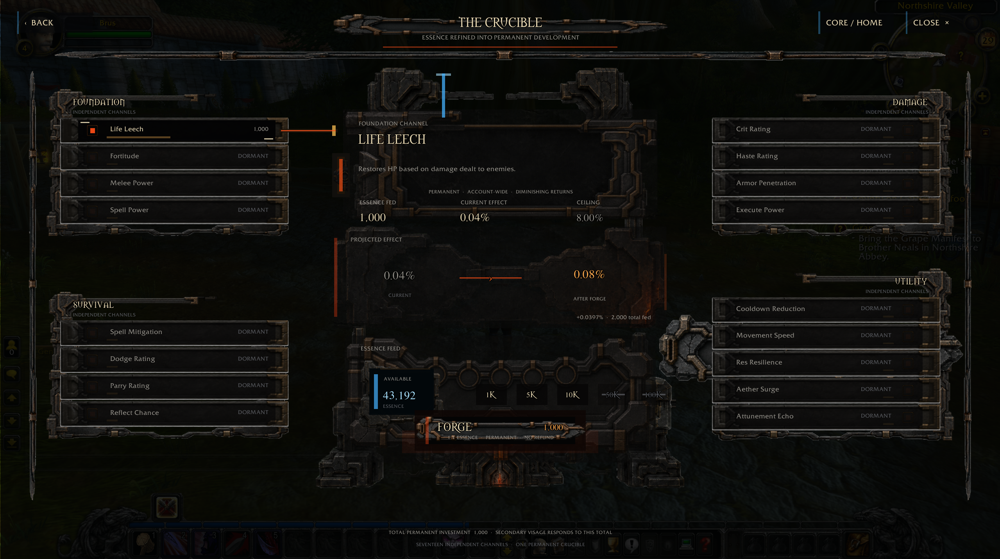
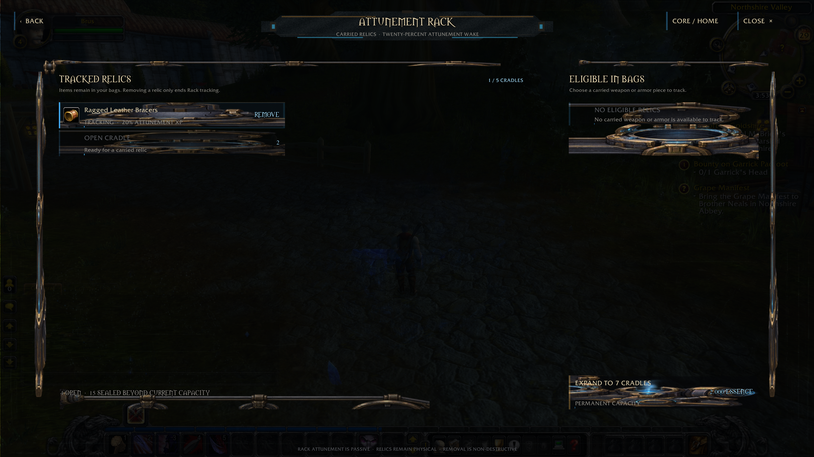
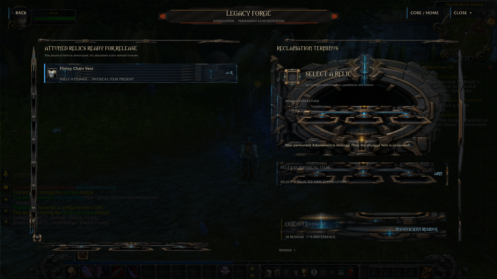
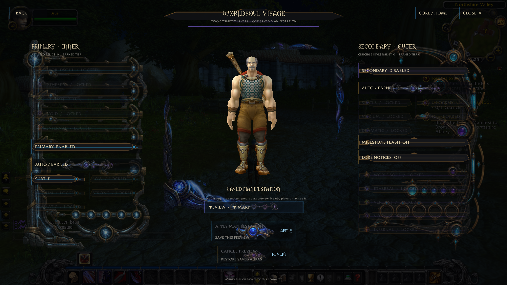
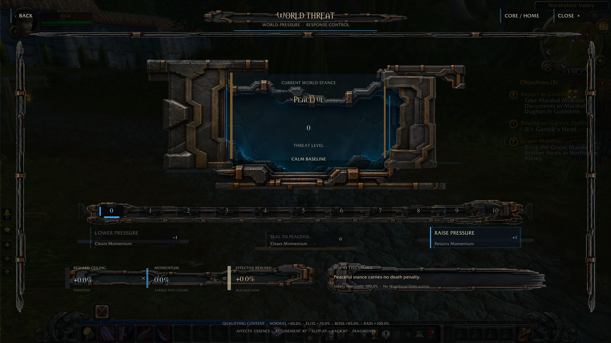

# Echoes of the Worldsoul

<!-- Header artwork slot (not yet created): once branded header art exists,
     place it at docs/images/echoes-of-the-worldsoul-header.png and add
     
     here, above the badges. Until then, the Dashboard screenshot in the
     Client Companion section below is the visual hero. -->

[](LICENSE)
[](https://github.com/vibecoder99-cmd/echoes-of-the-worldsoul/releases/tag/v2.0.0-rc1)
[](https://github.com/azerothcore/azerothcore-wotlk)
[](#playerbots-support)

A long-term progression module for AzerothCore WotLK 3.3.5a. Gear remembers
what you do with it: fight with a piece long enough and the Worldsoul begins
to answer, unlocking permanent stat power, a persistent account-wide
currency, and cosmetic effects that deepen the longer you stay attuned.

**Current release: [v2.0.0-rc1](https://github.com/vibecoder99-cmd/echoes-of-the-worldsoul/releases/tag/v2.0.0-rc1)** —
a release candidate, not yet final. This is the continuation of the same
project that shipped `v1.6.0-rc1`, substantially expanded since. See
[What's New in 2.0](#whats-new-in-20) if you saw Echoes before.

Open source (GPLv3), source-based install, no client modifications beyond an
additive AddOn and DBC patch. Jump to [Quick Start](#quick-start) or the full
[Installation Guide](INSTALL.md).

---

## What Is Echoes?

Echoes of the Worldsoul is a solo/self-paced progression layer that sits on
top of normal WotLK gameplay, built around one core idea: **your gear has a
history, and history is worth something.**

- **Attunement** — every piece of gear you fight with tracks its own
  progress. Full attunement is permanent, per-account, and survives moving
  the item between your characters.
- **Essence** — the currency attunement, kills, bosses, quests, and PvP
  earn you. It persists across sessions and is spent on permanent upgrades.
- **Mastery** — ranks up from spent Essence, permanently increasing how much
  stat power your attuned gear grants you.
- **The Crucible** — 18 categories of permanent, account-wide investment
  (Life Leech, Spell Mitigation, XP rate, and more).
- **The Attunement Rack** — up to 20 slots that let stored gear keep
  attuning passively without being equipped.
- **The Legacy Forge** — dissolve a fully-attuned item you no longer need
  into currency instead of letting it sit dead in your bags.
- **World Threat** — an optional, voluntary risk/reward challenge mode;
  higher threat means bigger rewards and real consequences for dying, not
  artificial stat inflation.
- **Visage** — cosmetic aura/flash effects that reflect how far your
  attunement has come.

None of this requires grouping, a guild, or any other player — it's built
for a self-paced or solo-friendly server, though nothing stops it from
running on a populated one.

---

## What's New in 2.0?

If you saw Echoes at `v1.6.0-rc1`, the short version: **the interface,
the Playerbots story, and the install experience are all different now.**
This isn't a new project — it's the same design, substantially
productionized and hardened.

| | |
|---|---|
| **New** | Production **Client Companion** graphical AddOn (previously chat-command-only); optional **Playerbots integration** (`mod-echoes-playerbots`); the **installer** (`installer/`) with tracked install/verify/upgrade/repair/uninstall; the `patch-E.MPQ` client-patch namespace with automatic migration from the old `patch-4.MPQ`; a dedicated **Accessibility** settings panel; split Docker/DML-style runtime layout support (`--lua-root`/`--config-root`) |
| **Rewritten / Expanded** | Stat/Crucible-effect application moved from Lua-only approximation into `mod-echoes-stats`, a compiled, engine-level module — now a required component, not optional |
| **Productionized / Hardened** | SQL schema evolution consolidated into idempotent, guarded migrations (`sql/schema/`); a real clean-room C++ compile matrix (Playerbots present *and* absent, both actually built and linked, not inferred); a live DML-compatible deployment certification end to end |

Everything above did not appear newly invented in 2.0 in every case — some
of it (like Playerbots integration and the stat engine) existed in earlier
form during the v1.6-era development track and has now been compiled,
tested, and shipped as part of the public package for the first time. See
[Compatibility Evidence](#compatibility-evidence) for exactly what was
verified and how.

---

## Playerbots Support

**Playerbots is entirely optional.** Echoes does not require it, and every
system above works identically with zero Playerbots dependency.

`mod-echoes-playerbots` is the optional integration layer that bridges
Echoes' attunement/progression systems to Playerbots-controlled characters
(awareness, retention, Rack interaction, bounded progression spending, and
explicitly gated Dissolution). Every Playerbots-dependent symbol it uses is
guarded by `#ifdef MOD_PLAYERBOTS` in the source, so the module compiles to
an inert no-op when Playerbots isn't present in your `modules/` tree — this
isn't a design claim, it's been proven by **actually compiling the module
in both configurations** (Playerbots present and Playerbots absent), not
inferred from reading the source.

Compatibility evidence for this release:

- Real clean-room builds completed with Playerbots present (475 real
  Playerbots engine symbols linked into the resulting binary) and with
  Playerbots absent (zero engine symbols, module still fully functional).
- Historically, this integration ran live in production at approximately
  **1,700–2,000 concurrent bots** over multiple days, with no Echoes
  compatibility rollback recorded.
- Current 2.0 source, build, and installer package paths were
  independently re-verified this release.

This is **tested against the documented AzerothCore/Playerbots environment
used for this release** — it is not a claim of support for every Playerbots
fork or configuration in existence.

---

## Dad's MMO Lab / DML Compatibility

**DML-compatible / tested with Dad's MMO Lab-style environments.** This is
a compatibility statement, not an endorsement, an affiliation, or an
official Dad's MMO Lab module.

Dad's MMO Lab-style deployments commonly run AzerothCore in Docker with a
split layout: the C++ module source lives at one root, while the actual
running server's Lua scripts and config live under a separate runtime
distribution root (bind-mounted, not the checkout itself). The installer
supports this directly with explicit `--lua-root`/`--config-root` flags
(auto-suggested by `echoes discover`) — see
[installer/README.md](installer/README.md#split-dockerdml-style-runtime-layouts).

---

## Client Companion

The Client Companion (`EchoesOfTheWorldsoulBridge`) is one of the largest
visible changes since `v1.6.0-rc1`: a full graphical AddOn, not a skin over
chat commands. It's a versioned client/server protocol backed by live
server-side Echoes state, with dedicated panels for:

Dashboard · Progression · Talents · World Threat · Crucible · Attunement
Rack · Legacy Forge · Visage · Codex/Search · Settings · Accessibility

<p align="center">
  
  <br>
  <em>The Dashboard: the hub every other panel opens from.</em>
</p>

<table>
<tr>
<td width="50%">

<br><em>Worldsoul Talents</em>
</td>
<td width="50%">

<br><em>The Crucible</em>
</td>
</tr>
<tr>
<td width="50%">

<br><em>Attunement Rack</em>
</td>
<td width="50%">

<br><em>Legacy Forge</em>
</td>
</tr>
<tr>
<td width="50%">

<br><em>Visage</em>
</td>
<td width="50%">

<br><em>World Threat</em>
</td>
</tr>
</table>

All 12 panels, in order, with short descriptions:
**[docs/CLIENT_COMPANION_GALLERY.md](docs/CLIENT_COMPANION_GALLERY.md)**.

---

## Quick Start

**Prerequisites:** an AzerothCore 3.3.5a checkout with `mod-ale` (Eluna,
`LUA_VERSION=lua52`) built in, MySQL/MariaDB, and a compatible WoW 3.3.5a
(build 12340) client. See [Requirements](#requirements--compatibility)
below for the full matrix.

```bash
installer/bin/echoes.sh install \
  --azerothcore-root /path/to/your/azerothcore \
  --mysql-user <user> --mysql-password <password> \
  --characters-database acore_characters --world-database acore_world \
  --client-root "/path/to/WoW 3.3.5a.12340"
```

- Add `--with-playerbots --confirm-playerbots-compatible` only if you run
  mod-playerbots and have verified compatibility yourself.
- **Split Docker/DML-style deployment?** Run `echoes.sh discover
  --azerothcore-root ...` first — it detects the layout and suggests the
  right `--lua-root`/`--config-root` flags.
- **Fresh client, automatic `Item.dbc` extraction failed?** That's a known
  limitation (see [Fresh-Client Note](#fresh-client-itemdbc-note)), not a
  broken install — extract it once with any MPQ editor and pass
  `--vanilla-dbc-path`.
- Confirm everything landed correctly: `installer/bin/echoes.sh verify
  --azerothcore-root /path/to/your/azerothcore`

On Windows use `installer\bin\echoes.ps1` in place of `echoes.sh`. Full
walkthrough, manual (non-installer) steps, and every command's exact
semantics: **[INSTALL.md](INSTALL.md)**.

---

## Upgrading from v1.6.0-rc1 / Older Echoes Installs

The installer detects and handles a pre-installer legacy layout
automatically — run `install` (it adopts an existing deployment into
installer management) or `upgrade` (if a manifest already exists):

- **Legacy files are positively identified before anything is touched** —
  by content signature, never by filename alone. The old dev-only
  `ap_gm_aether.lua` and the legacy `mod-attunement-plus/` module (if
  present) are retired only once identified this way, and only after
  their replacements are already installed.
- **The old `patch-4.MPQ` client patch is migrated to the new `patch-E.MPQ`
  namespace** automatically, once positively identified as Echoes' own
  prior output — never touched if it can't be proven.
- **Everything is backed up before being replaced.** Nothing is deleted
  first "just in case" — see `echoes-installer-backups/` after any run.
- **Database migrations preserve existing player/progression data.**
  `sql/schema/` is idempotent and only ever adds what's missing.

Do not manually delete old files before running the installer — let it
detect and migrate them; that's exactly what the positive-identification
step is for. This does not extend to unknown, custom-forked deployments —
the guarantee above is for a genuine prior Echoes install, not an arbitrary
modification.

---

## This Is Not a Repack

Echoes is entirely source-based. This repository includes:

Lua · SQL · C++ module source · the installer · the client AddOn · DBC
patch-generation tooling · documentation

It does **not** include, and never will:

a WoW client · Blizzard client data · a custom `Wow.exe` · AzerothCore
binaries · Playerbots source · `mod-ale` source

**No custom WoW executable and no redistributed WoW client required.**
Echoes installs an additive client package into an existing, separately
obtained, compatible 3.3.5a client — it does not claim that client is
otherwise unmodified by anything else you may have installed.

---

## Requirements / Compatibility

| Component | Status | Notes |
|---|---|---|
| AzerothCore 3.3.5a | Required | Source checkout, buildable with CMake — a binary-only install is not sufficient |
| `mod-ale` (Eluna) | Required | External prerequisite, not bundled. Build with `LUA_VERSION=lua52` |
| MySQL / MariaDB | Required | `acore_characters`/`acore_world`/`acore_auth` must already exist |
| WoW 3.3.5a client (build 12340, enUS) | Required | Clean/unmodified copy — see [This Is Not a Repack](#this-is-not-a-repack) |
| Playerbots (`mod-playerbots`) | Optional | See [Playerbots Support](#playerbots-support) |
| Docker / DML-style split layout | Optional, supported | `--lua-root`/`--config-root`; auto-detected by `discover` |
| Windows | Tested | `installer\bin\echoes.ps1`; RelWithDebInfo build |
| Linux / WSL | Tested | `installer/bin/echoes.sh`; used for the live DML certification this release |
| Python 3.6+ | Required | For the installer and DBC patch tooling |

Do not read this as a guarantee across every possible AzerothCore fork or
Eluna build — see [Compatibility Evidence](#compatibility-evidence) for
exactly what was tested, and `zz_eluna_probe.lua` for a live compatibility
probe you can run against your own build.

**Known unsupported Eluna APIs** (workarounds already in place):
`RegisterCommand`, `Player:SetStat`, `Player:IsQuestRewarded`, `HasAura`,
`GetBagSize`, `GetFloat`, `Player:GetGMLevel`.

### Fresh-Client Item.dbc Note

The installer can automatically extract a vanilla `Item.dbc` from your
client's own stock archives (via the optional `mpyq` package). **Some real
3.3.5a MPQ variants are not fully supported by this optional extraction
path** — many retail WotLK archives use an MPQ header format `mpyq` has
incomplete support for. This is a known, documented limitation, not a
reflection of a problem with your client.

The reliable fallback: extract `DBFilesClient\Item.dbc` yourself with any
MPQ editor (e.g. Ladik's MPQ Editor), then pass
`--vanilla-dbc-path /path/to/Item.dbc`. This project does not redistribute
Blizzard's `Item.dbc` and will not link to third-party client downloads.

---

## Architecture

Four layers, each independently understandable:

1. **Echoes Core** (`lua_scripts/`) — the Eluna gameplay/runtime logic:
   attunement, Essence, Mastery, Crucible, Rack, Forge, World Threat,
   Visage, and the client/server protocol.
2. **Engine Integration** (`cpp_patch/mod-echoes-stats/`, required) —
   compiled, engine-level stat and Crucible-effect application.
3. **Optional Playerbots Integration** (`cpp_patch/mod-echoes-playerbots/`)
   — self-gated at compile time; see [Playerbots Support](#playerbots-support).
4. **Client Companion + Installer** (`client_addon/`, `installer/`) — the
   graphical AddOn, generated `patch-E.MPQ`, and the full lifecycle tooling
   (SQL migrations, manifest, install/verify/upgrade/repair/uninstall).

---

## Repository Structure

```
echoes-of-the-worldsoul/
├── installer/             Python installer core + Bash/PowerShell wrappers
│                           (install, verify, upgrade, repair, uninstall,
│                           client-package, discover) + regression tests
├── lua_scripts/            Server-side Eluna Lua scripts (28 files)
├── cpp_patch/
│   ├── mod-echoes-stats/       Required -- engine-level stat/Crucible-effect application
│   └── mod-echoes-playerbots/  Optional -- Playerbots integration, self-gated at compile time
├── sql/
│   ├── schema/             00_preflight.sql .. 90_validation.sql -- idempotent install package
│   └── data/               world_items.sql -- custom item rows (acore_world)
├── dbc_patch/              patch_item_dbc.py, mpq_writer.py, build_patch_mpq.py, tooling docs
├── client_addon/           EchoesOfTheWorldsoulBridge WoW AddOn (Client Companion)
├── docs/                   API.md, EXTENSIONS.md, compatibility evidence ledger
├── .github/                Issue templates
├── INSTALL.md
├── CHANGELOG.md
├── RELEASE_NOTES_v2.0.0-rc1.md
├── LICENSE
└── README.md
```

Not included in this repository: `mod-ale` and `mod-playerbots` (both
external prerequisites — see Requirements above).

---

## Configuration

Server-runtime gameplay tuning (attunement rates, Essence rewards, Mastery
thresholds, Crucible sink caps, Rack slot costs, Forge rewards, Visage
themes) lives in `ap_core.lua`'s `AP.Config` table and the respective
`ap_*.lua` files — edit and `.reload eluna` in-game, no database change or
restart needed. C++ module settings (`EchoesStats.*`,
`EchoesPlayerbots.*`) live in `etc/modules/*.conf` and take effect on
restart. Client-side preferences (Accessibility, UI options) are stored by
the AddOn itself and never touch the server.

---

## Testing

**In-game (GM only):** `#aptest` runs the full regression suite — 20 suites,
214 individual tests, covering math, database, tooltip, anti-spam, quest,
aether, UI, Forge, Residue, Crucible, Visage, PvP, voice, versioning,
exploit guards, and every numbered tier's fixes. Run an individual suite
with e.g. `#aptest tier6` or `#aptest threat`.

**Installer regression (Python, disposable fixtures only):** 200+
assertions across single-root, split-root, legacy-migration, and
attack-style test files, re-run from an extracted release artifact as
part of this RC's own preparation.

**C++ module tests:** 247/247 assertions passing across the module's
standalone unit test files.

**Clean-room compile evidence:** real compiled builds with Playerbots
present and absent, not inferred.

These are separate, non-comparable test populations — see
[Compatibility Evidence](#compatibility-evidence) below rather than
adding them together.

---

## Compatibility Evidence

Most users won't need to read the full technical ledger. Summary of what
was independently verified for this release:

- Clean-room C++ builds with Playerbots present and absent (both actually
  compiled and linked)
- DML-style and generic-AzerothCore installer walkthroughs
- The split Docker/DML-style runtime layout fix, verified live against a
  real deployment
- A package-equivalent server built and booted from the installer's own
  output
- Client Companion package reproduction: 273/273 files byte-identical to
  a real deployed install
- Live `patch-4.MPQ` → `patch-E.MPQ` migration, verified against a real
  client
- Full live client route/action validation (login, item resolution, every
  Client Companion panel, one reversible server-backed action)
- Historical Playerbots load validation at ~1,700–2,000 concurrent bots

Full evidence, methodology, and every individual finding:
**[docs/COMPATIBILITY-ATTACK-DEFECT-LEDGER.md](docs/COMPATIBILITY-ATTACK-DEFECT-LEDGER.md)**.

---

## Extension API

Echoes exposes `AP.API` for future dependent modules (Empire, Prestige,
Companions, Fusion Forge, etc.) — see [docs/API.md](docs/API.md) and
[docs/EXTENSIONS.md](docs/EXTENSIONS.md). Extensions register via
`AP.API.RegisterExtension()` and subscribe to game events via
`AP.API.RegisterHook()`; hook dispatch is pcall-safe, so one extension's
error can't crash the base module.

---

## Getting Help

- **Bugs and compatibility reports:** [GitHub Issues](https://github.com/vibecoder99-cmd/echoes-of-the-worldsoul/issues/new/choose)
  — please include your AzerothCore revision, Eluna version, OS,
  single-root/split-layout, installer-or-manual install, Playerbots
  presence, client build, and any relevant logs.
- **Installation questions, "will this work for me," general discussion:**
  [GitHub Discussions](https://github.com/vibecoder99-cmd/echoes-of-the-worldsoul/discussions)
- **Troubleshooting common issues:** [docs/TROUBLESHOOTING.md](docs/TROUBLESHOOTING.md).

Please do not include database passwords, credentials, or other secrets in
issue reports.

---

## Contributing

See [CONTRIBUTING.md](CONTRIBUTING.md).

## Security

See [SECURITY.md](SECURITY.md) for how to report a security-relevant issue
(e.g. installer path handling, unsafe database behavior).

---

## Acknowledgments

Echoes was originally inspired by the item-attunement system of the
**Synastria** WoW private server, and later by **Peloria**'s more recent
approach to permanent item-based progression. Echoes is independently
implemented from scratch for AzerothCore — its own design, database
schema, Lua architecture, and feature set. No affiliation with or
endorsement by either project is claimed. The motivation is simple: make
this style of permanent, gear-driven progression available to anyone
running their own AzerothCore environment, not just players of those
specific servers.

Developed with the assistance of **Claude** (Anthropic) as an AI pair
programmer.

Special thanks to **PRAN**, Level 80 Orc Warrior, who endured every crash,
exploit, and item-loss incident this project produced during the original
Eluna-era test campaign and is still standing — and to the many
short-lived Orc Warrior clones created, tested, and deleted in his shadow,
whose sacrifices were no less essential and whose names history does not
record.

And to **BRUS**, Level 4 Human Warrior, principal live test character of
the compatibility-hardening, Dad's MMO Lab, Playerbots, and Client
Companion era — proof that you don't need to be high level to do
important, dangerous work.

---

## License

Copyright (C) 2025-2026 vibecoder99.
Licensed under the GNU General Public License v3.0 or later. See `LICENSE`.
