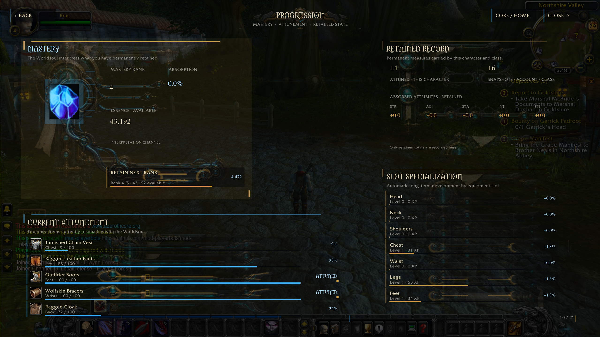
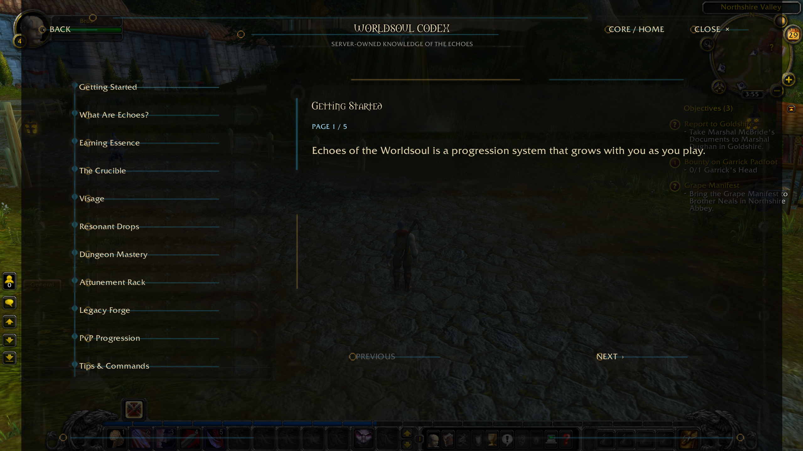
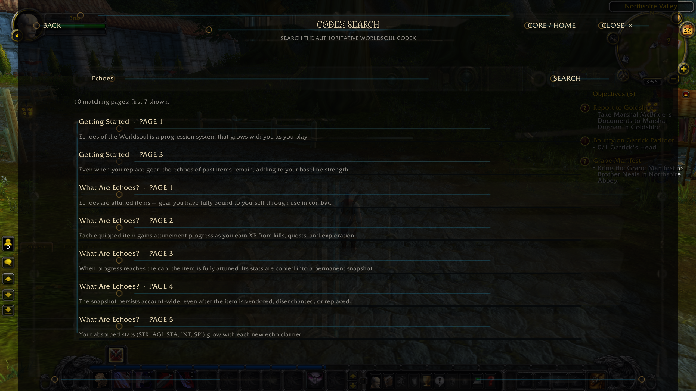
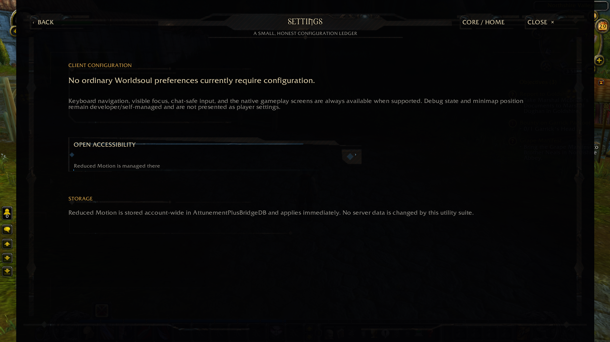
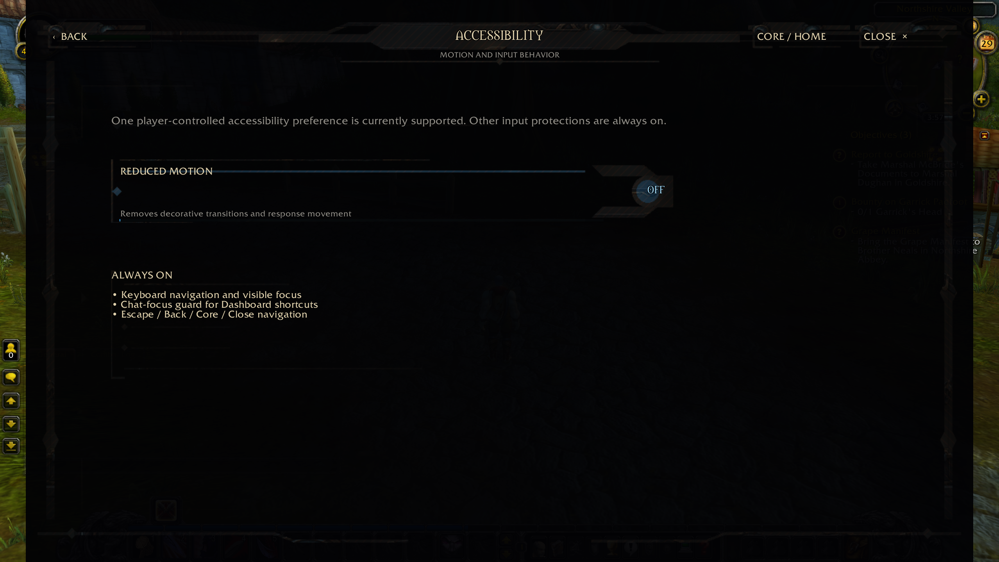

# Client Companion Gallery

All 12 panels of the `EchoesOfTheWorldsoulBridge` Client Companion AddOn,
shown here from a real live character (`Brus`, Northshire Valley) on a
Dad's MMO Lab-style compatibility deployment. These are authoritative,
current in-game screenshots — not concept art or pre-implementation
mockups.

Every panel is opened from the Dashboard hub and can be closed or
navigated back from at any time; none of this requires memorizing chat
commands.

---

## Dashboard

The central hub. Every other panel — Codex, Progression, Talents, World
Threat, The Crucible, the Attunement Rack, the Legacy Forge, Visage,
Settings, and Accessibility — opens from here, along with your current
Essence total at a glance.

---

## Progression

Your Mastery rank and available Essence, a live view of which equipped
items are currently attuning (with percent-to-completion for each), your
account-wide Retained Record of past attunements, and per-slot
Specialization progress that builds up automatically over time.

---

## Talents

Worldsoul Talents let you permanently invest Essence into one of five
independent stat anchors (Strength, Agility, Stamina, Intellect, Spirit).
Each investment is permanent and shows you the exact before/after
percentage and Essence cost before you commit.

---

## World Threat

An optional, entirely voluntary risk/reward dial. Raising your World
Stance from Peaceful increases your reward ceiling for qualifying content
but removes your safety net — the panel shows your current stance, threat
level, and exactly what's at risk before you touch it.

---

## Crucible

Seventeen independent, permanent, account-wide channels (Life Leech,
Fortitude, Crit Rating, Movement Speed, and more) that you feed Essence
into one at a time. The panel always shows your current effect and the
exact projected effect after your next investment before you spend
anything.

---

## Attunement Rack

Lets you keep attuning gear you're carrying but not currently wearing.
Items stay physically in your bags the whole time — tracking them on the
Rack doesn't remove or lock them, and removing a relic from the Rack only
ends the tracking, nothing more.

---

## Legacy Forge

Once an item is fully attuned, the Legacy Forge lets you dissolve the
physical item for Essence, gold, and Residue instead of it sitting dead
weight in your bags — your permanent attunement progress is retained even
after the item itself is gone.

---

## Visage

Cosmetic aura effects, layered as an inner (Primary) and outer (Secondary)
manifestation, that reflect how far your attunement and Crucible
investment have come. Previews are real, temporary, and visible to nearby
players before you commit to saving one.

---

## Codex

An in-client reference for how Echoes actually works — Getting Started,
Earning Essence, the Crucible, Visage, Resonant Drops, Dungeon Mastery,
the Attunement Rack, the Legacy Forge, PvP Progression, and Tips &
Commands — written for players, not developers.

---

## Codex Search

Full-text search across the entire Codex, so you can look up a specific
mechanic (like "Echoes") without paging through every section by hand.

---

## Settings

A small, honest configuration ledger — most of the Client Companion
doesn't need player-tunable settings, and this panel says so directly
rather than padding itself out with sliders that don't do anything.

---

## Accessibility

A Reduced Motion toggle to remove decorative transitions and response
movement, alongside a list of protections that are always on regardless
of settings: full keyboard navigation with visible focus, a chat-focus
guard so Dashboard shortcuts don't fire while you're typing, and
consistent Escape/Back/Core/Close navigation throughout every panel.

---

Back to [README](../README.md#client-companion).
